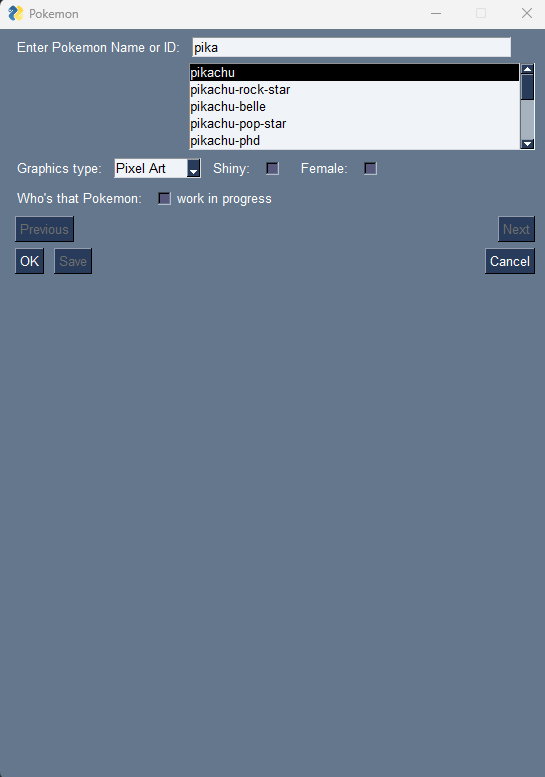
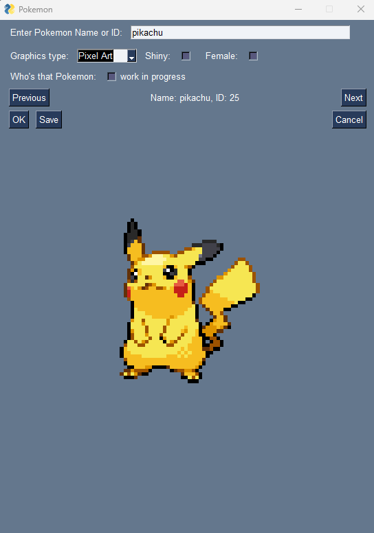
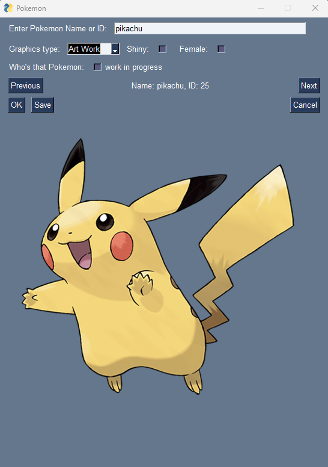
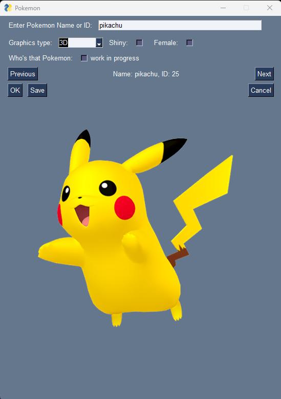
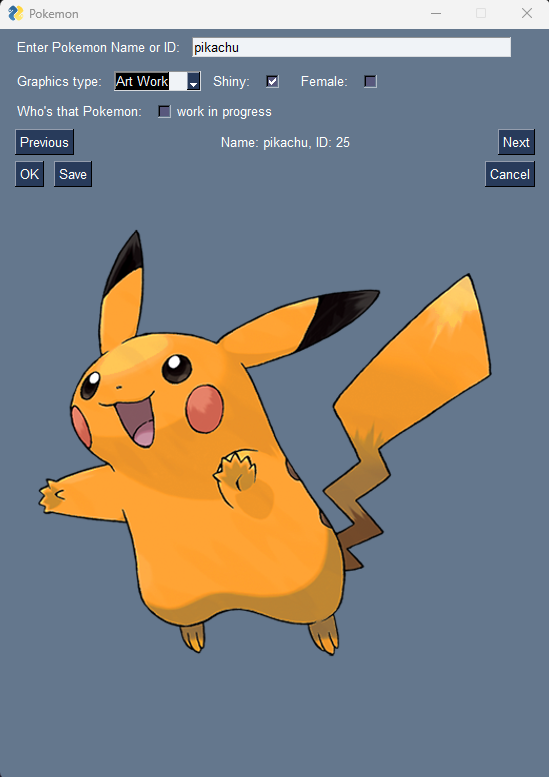
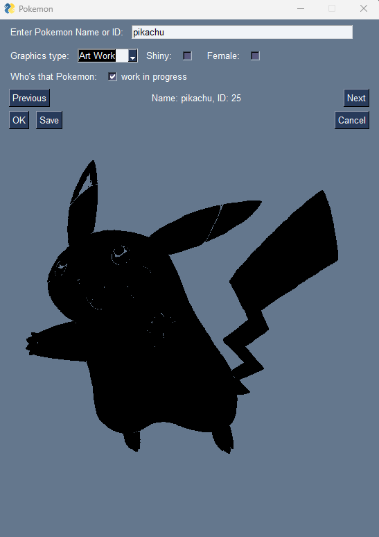

# Pokémon Image Viewer

A desktop application written in **Python** that allows users to search for Pokémon by name or Pokédex ID, preview different sprite variants, and save images to their computer.

The application uses the **PokeAPI** to retrieve Pokémon data and images. Downloaded images are cached locally, making future access faster and reducing unnecessary API requests.

---

## Features

- 🔍 Search Pokémon by **name** or **Pokédex ID**
- ✨ Autocomplete suggestions while typing
- 🖼️ Choose between three image styles:
  - Pixel Art
  - Official Artwork
  - 3D HOME Sprite
- ⭐ Display **Shiny** variants
- ♀️ Display **Female** variants (when available)
- ❓ Generate a **"Who's That Pokémon?"** silhouette
- ⬅️➡️ Browse to the previous or next Pokémon
- 💾 Save images to any location on your computer
- 📂 Local image cache to avoid downloading the same image multiple times

---

## Built With

- Python
- FreeSimpleGUI
- Requests
- Pillow (PIL)
- JSON
- Regular Expressions (re)
- PokeAPI

---

## Installation

### Clone the repository

```bash
git clone https://github.com/AS0WA/pokemon-image-viewer.git
cd pokemon-image-viewer
```

### Install dependencies

```bash
pip install -r requirements.txt
```

If you don't have a `requirements.txt` file, install the required packages manually:

```bash
pip install requests pillow FreeSimpleGUI
```

---

## Running the application

Run the application with:

```bash
python main.py
```

---

## Usage

1. Enter a Pokémon name or Pokédex ID.
2. Select the desired image type:
   - Pixel Art
   - Art Work
   - 3D
3. Optionally enable:
   - Shiny
   - Female
   - Who's That Pokémon
4. Press **OK** to load the image.
5. Use **Previous** and **Next** to browse Pokémon.
6. Press **Save** to save the image anywhere on your computer.

---

## How it works

When the application starts for the first time:

- it creates a `pokemons` directory,
- downloads the complete Pokémon list from PokeAPI,
- stores it locally in `.pokemons.json`.

Whenever a Pokémon is requested:

1. The application checks if the image already exists locally.
2. If it does, it loads the cached image.
3. Otherwise, it downloads the image from PokeAPI.
4. The image is resized to **500 × 500 pixels**.
5. The image is saved in the local cache.

This reduces API requests and makes loading previously viewed Pokémon much faster.

---

## Project Structure

```
pokemon-image-viewer/
│
├── main.py
├── README.md
└── pokemons/
    ├── .pokemons.json
    ├── *.png
```

---

## Screenshots

### Main window


### Search and autocomplete



### Different image styles





### Different image variants




### "Who's That Pokémon?"



---

## Data Source

This project uses the free Pokémon REST API:

https://pokeapi.co/

---

## Future Improvements

Possible future features include:

- Animated sprites
- Pokémon forms (Alolan, Galarian, Hisuian, etc.)
- Mega Evolutions
- Search by Pokémon type
- Search history
- Favorite Pokémon list
- Dark mode
- Better exception handling
- Performance improvements
- Packaging as an executable (.exe)

---

## License

This project is intended for educational and portfolio purposes.

Pokémon images and data are provided by **PokeAPI** and belong to their respective owners.
